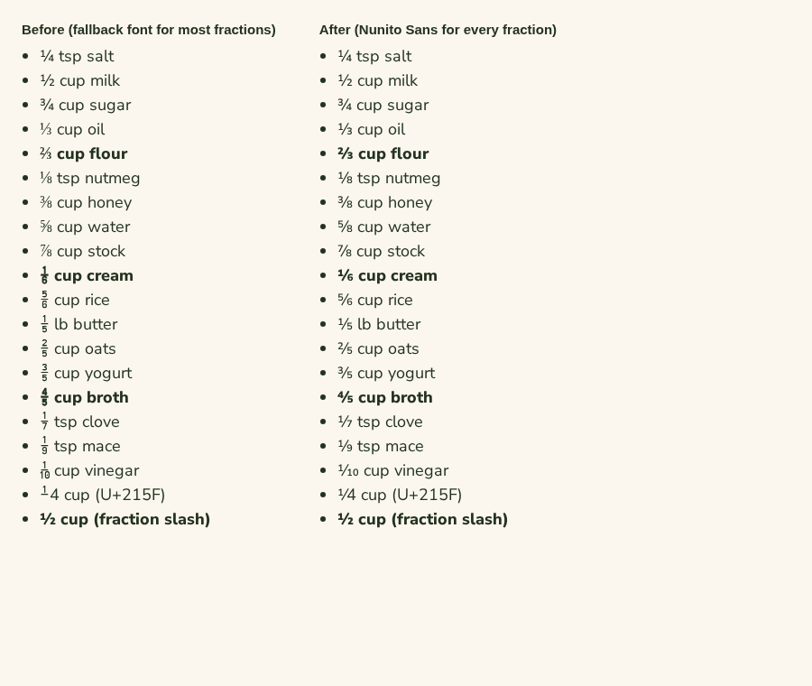

# Fonts

Crumb self-hosts four woff2 files in `web/src/assets/fonts/`, each with a metric-matched fallback
in `web/src/styles/app.css`.

| File | Font | Source |
| --- | --- | --- |
| `nunito-sans.woff2` | Nunito Sans, variable weight 200–1000 | Built by `scripts/fonts/build-nunito-sans.sh` |
| `dm-serif-display.woff2` | DM Serif Display | Google Fonts, Latin subset |
| `caveat.woff2` | Caveat (greetings and tips) | Google Fonts, Latin subset |
| `kalam.woff2` | Kalam Regular (the cook's notes) | Built by `scripts/fonts/build-kalam.sh` |

## Nunito Sans

Imports write quantities as Unicode fractions and scaling can produce any of them, so the body font
carries every vulgar fraction (U+2150–215F) as well as ¼ ½ ¾. Nunito Sans only draws ¼ ½ ¾ itself.
The rest are added as composites built the same way: the numerator figure raised, the fraction slash,
then the denominator. They're laid out exactly as the font's own `frac` feature sets "1⁄3" at every
weight (`scripts/fonts/nunito_fractions.py`).

To rebuild (needs `uv`):

```bash
scripts/fonts/build-nunito-sans.sh
```

The script downloads the variable source from a pinned `google/fonts` commit (checksum verified) and
adds the fractions. It then pins optical size 12, width 100 and YTLC 500 as Google's web font does,
keeping weight variable, and cuts the file to Google's Latin subset plus the fractions. The output is
byte-for-byte reproducible. Keep U+2150–215F in `UNICODES` when changing the subset.

Every other glyph matches Google's own file: advances, kerning and outlines are identical at every
weight, so the fallback's `size-adjust` and overrides still line up. If a rebuild changes vertical
metrics or widths, re-check the fallback in `app.css`.



## Kalam

The cook's notes are set in Kalam (`.note-hand`, `--font-note`), a handwriting face that stays easy
to read over a long paragraph. Caveat remains for the short greetings and tips (`.hand`).

Notes are free text in any language, so the file keeps Google's whole Latin subset: accents (ñ, é,
ç), °, ¼ ½ ¾, dashes and curly quotes. Kalam draws no other vulgar fractions, so each page declares
a second `Kalam` face pointing at Nunito Sans with `unicode-range: U+2150-215F`: ⅓ and friends come
from the body font, which is already loaded, instead of whatever the system has.

To rebuild (needs `uv`):

```bash
scripts/fonts/build-kalam.sh
```

It downloads `Kalam-Regular.ttf` from a pinned `google/fonts` commit (checksum verified) and subsets
it. The output is byte-for-byte reproducible. The fallback in `app.css` ("Kalam Fallback", on Arial)
is matched to this file's widths and vertical metrics.
